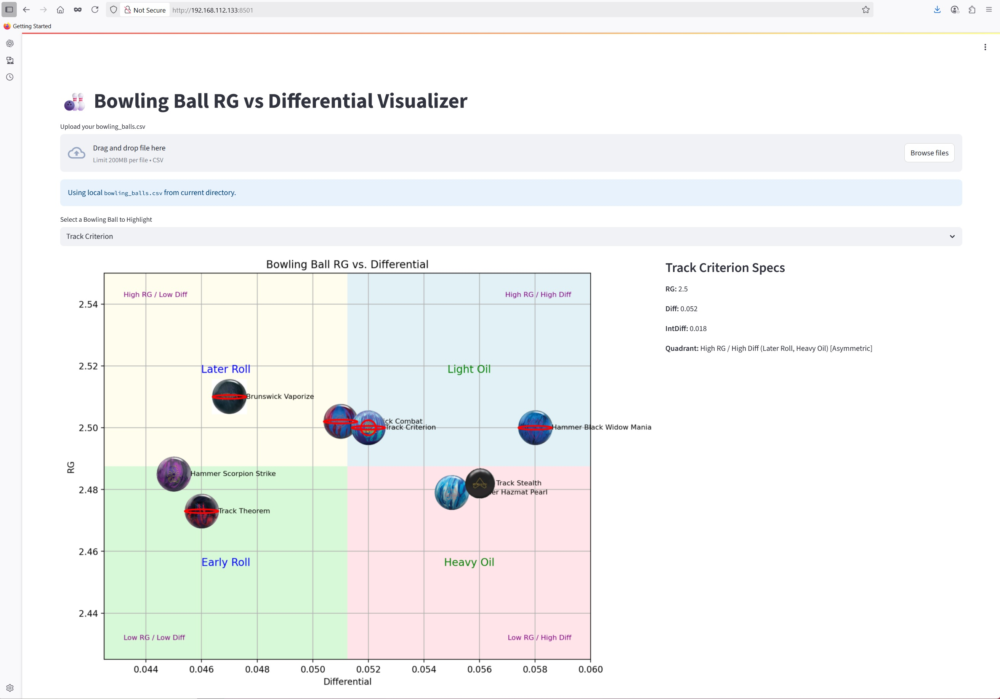

This is a utility to graph bowling balls based on RG and Differential.

To run this utility:

pip install streamlit

streamlit run app.py

This utility takes as input a csv file, in which the bowling ball name, RG, diff, and intermediate diff need to be provided by the user. This utility will also need each bowling ball icon to be downloaded as a png file format and sized as 200 by 200 pixels. If no images are provided a default image is provided.

-----------------------------
Bowling Ball Definitions

Radius of Gyration: How quickly the ball starts to spin as it rolls down the lane.
RG measures how the ball’s mass is distributed from its center.
The ball is spun around an axis; the slower the spin (higher RG), the more the weight is pushed toward the shell.
Lower RG balls read the lane early, ideal for heavy oil.

RG Differential: The difference between the maximum and minimum RG values of a ball, showing the core’s “asymmetry” in shape.
RG Differential=RGmax​−RGmin​
Higher Differential balls have a strong flare potential and backend motion.

Mass Bias Differential (Intermediate Differential): The difference between the intermediate RG and the lowest RG, only for asymmetrical cores.
Mass Bias Diff=RGint​−RGmin​

Concept				Analogy/Visual
RG				Skater: arms in (low RG) = quick spin, arms out (high RG) = long glide
Differential			Sports car (high diff) zig-zags easily; bus (low diff) turns slowly
Mass Bias Differential		Fast lane change (high MB diff) vs. smooth merge (low MB diff)

Quick Reference—When to Use Which

Low RG, High Diff, High MB Diff: Early read, max hook, sharp backend—great for floods and sport patterns.

High RG, Low Diff, Low MB Diff: Skid, control, mild backend—best for dry/burned lanes or spares.

Mediums: Best for “benchmark” balls that fit most house shots and medium sport conditions.

